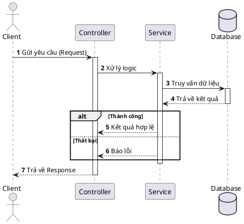
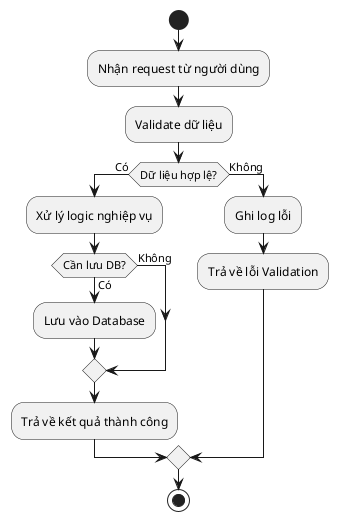
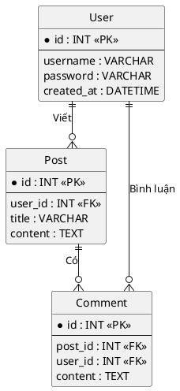

# 🎨 Create Diagram Skill

Skill này hướng dẫn LLM cách tạo code PlantUML chuẩn xác và chuyên nghiệp để mô hình hóa hệ thống, bao gồm Sequence Diagram, Activity Diagram, và Entity Relationship Diagram (ERD).

## 📋 Hướng dẫn chung (General Guidelines)

1. **Hiểu rõ yêu cầu:** Trước khi vẽ diagram, cần đọc kỹ yêu cầu, tài liệu hoặc phân tích source code liên quan để xác định đúng các thành phần (actors, components, entities) và luồng tương tác/logic.
2. **Cấu trúc cơ bản:** Mọi đoạn code PlantUML phải bắt đầu bằng `@startuml` và kết thúc bằng `@enduml`.
3. **Theme & Styling:** Sử dụng theme gọn gàng nếu cần, hoặc giữ style mặc định nhưng đảm bảo code dễ đọc.
4. **Ngôn ngữ:** Sử dụng tiếng Việt (hoặc tiếng Anh nếu hệ thống dùng toàn bộ tiếng Anh) cho các mô tả, tên bước, ghi chú trong diagram. Đảm bảo rõ ràng và súc tích.

---

## 1. 🔄 Sequence Diagram (Biểu đồ Tuần tự)

Sử dụng để mô tả luồng giao tiếp giữa các object/component (VD: Client, Controller, Service, Database) theo thời gian.

**Quy tắc:**
- Khai báo các đối tượng (actor, participant, database) rõ ràng ở đầu.
- Dùng `autonumber` để tự động đánh số các bước.
- Sử dụng các loại mũi tên phù hợp:
  - `->` : Gọi hàm, gửi request (đồng bộ)
  - `-->` : Trả về kết quả (return)
  - `->>` : Gọi bất đồng bộ (async)
- Dùng `activate` và `deactivate` (hoặc `++` và `--`) để biểu diễn thời gian sống (lifeline) của quá trình xử lý.
- Dùng `alt/else` cho điều kiện (if/else), `opt` cho tùy chọn, `loop` cho vòng lặp.

**Template mẫu:**


---

## 2. ⚡ Activity Diagram (Biểu đồ Hoạt động)

Sử dụng để mô tả luồng logic nghiệp vụ, các bước xử lý của một chức năng hoặc thuật toán.

**Quy tắc:**
- Sử dụng syntax mới của PlantUML (`start`, `stop`, `end`).
- Dùng `:` và `;` để định nghĩa một hành động (Action).
- Dùng `if () then () else ()` cho rẽ nhánh điều kiện.
- Dùng `repeat` ... `repeat while` hoặc `while` ... `endwhile` cho vòng lặp.
- Dùng `fork` ... `fork again` ... `end fork` cho xử lý song song (parallel).

**Template mẫu:**


---

## 3. 🗄️ Entity Relationship Diagram - ERD (Biểu đồ Thực thể - Liên kết)

Sử dụng để mô tả cấu trúc cơ sở dữ liệu, các bảng và mối quan hệ giữa chúng.

**Quy tắc:**
- Sử dụng từ khóa `entity` hoặc `table` để định nghĩa các bảng.
- Định nghĩa khóa chính (`PK`) bằng ký hiệu `*` hoặc biểu tượng chìa khóa.
- Khóa ngoại (`FK`) cần được ghi chú rõ.
- Biểu diễn mối quan hệ rõ ràng:
  - `||--o{` : 1 - Nhiều (One to Many)
  - `||--||` : 1 - 1 (One to One)
  - `}o--o{` : Nhiều - Nhiều (Many to Many)
- Có thể phân nhóm các bảng liên quan bằng `package` hoặc `namespace`.

**Template mẫu:**


## 🎯 Luồng thực hiện (Workflow)

1. Nhận yêu cầu vẽ diagram từ User.
2. Đọc code / tài liệu liên quan để hiểu nghiệp vụ và cấu trúc dữ liệu.
3. Lựa chọn loại diagram phù hợp (Sequence cho API flow, Activity cho luồng nghiệp vụ/logic hàm, ERD cho database schema).
4. Viết code PlantUML, bọc trong thẻ markdown ````plantuml`.
5. Đảm bảo syntax đúng, logic mạch lạc và dễ đọc.
